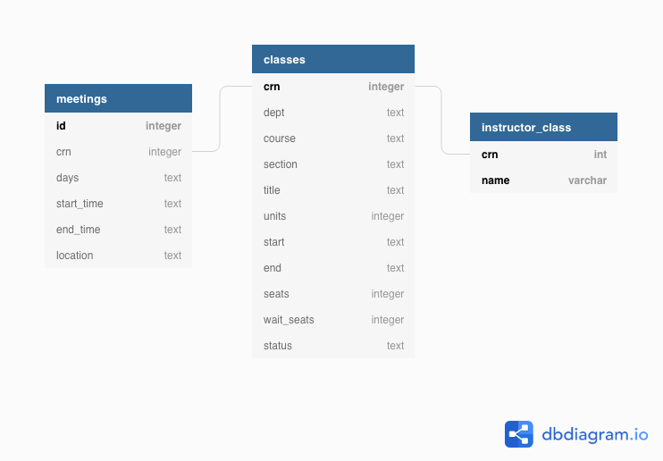

# Designing a relational database

- use the json data of Foothill College classes from OpenCourseAPI
- practice building a database in sqlite and python

## Requirements

- python 3 
- use a virtual environment `python3 -m venv venv`
- install requirements with `pip install -r requirements.txt`

## Files

- `fh-classes.json` - Foothill college class data for Fall 2020
- `create_tables.py` - creates the tables `classes`, `instructor_classes`, and `meetings`
- `etl.py` - loads the data from `fh-classes.json` into the database
- `schema.dbml` - table schema using database markup language
- `ER_diagram.png` - Entity-Relationship diagram using `schema.dbml` and [dbdiagram.io](https://dbdiagram.io/home)

## Code

- view the jupyter notebook [output](https://github.com/DanielNghiem/relational_model/blob/master/model_open_course_data.ipynb)

## Tables
